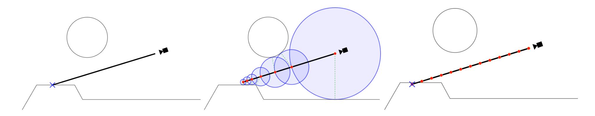
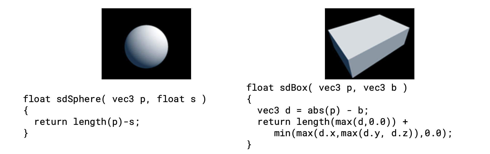
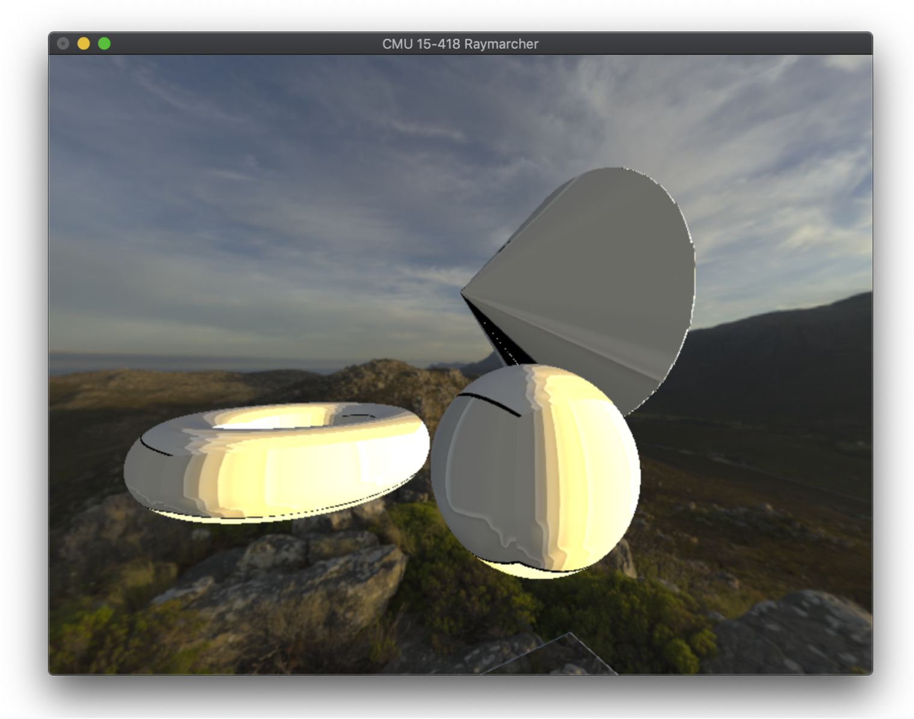
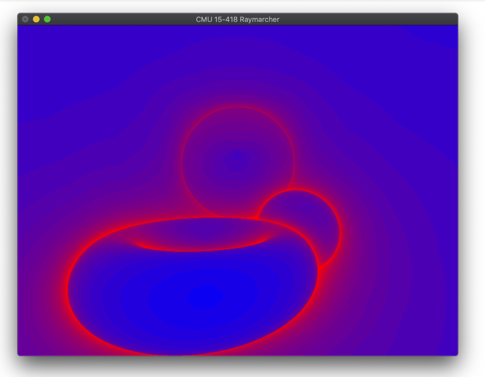

# CMU 15-418, Spring 2019 Final Project
### Adrian Biagioli / Chiara Mrose

This is a CUDA-based renderer that uses raymarching of signed distance fields to realize complex primitive-based scene descriptions.

## Building

From the root directory, run:
```
$ make
```
This will create a new directory called `build` with the executable `raymarcher`

On MacOS, you can alternatively run:
```
$ make xcode-project
```

This will create an xcode project in a new directory called `xcode`.  To clean any build artifacts, run:
```
$ make clean
```

You will notice that the `Makefile` in the root directory is a thin layer on top of CMake.  Therefore you can build for other platforms / tools that are supported by `cmake`.  For example, you can open the `renderer/` folder in CLion and it will work out of the box.

## Running

To run the current test scene, run
```
$ ./raymarcher test
```

## Background

*Raymarching* is a modification of raytracing that is suitable for real-time applications.  On a high level, a raymarching-based renderer has the same structure as a raytracer: for each pixel of a rendered image, rays are cast into a scene and the final color of each pixel is computed as a function of the raycast hit point, hit normal, and surface material.  In raytracing, we compute ray-primitive intersections "directly," that is, the raytracer executes an expression for each primitive that computes if / where each camera ray intersects that primitive.  Acceleration structures (such as a BVH) are used to reduce the number of these ray-primitive intersection queries.  Raymarching offers an alternative approach: we "march" a point along the ray until we find that the point intersects an object.  Instead of describing the scene as a list of primitives, we can create a description called a *signed distance field* (SDF).  The SDF is a scalar field that yields, for each point, the shortest distance from that point to the rest of the scene.  If the point is inside an object, the SDF is negative.  A SDF scene representation allows an optimized raymarcher to efficiently traverse the scene.



*Left: Visualization of Ray-Primitive intersection in Raytracing.  Middle: Naive Raymarching; Red circles represent sample points.  Right: Raymarching using SDFs; dotted green line lines (radius of the blue circles) point to the closest surface in the scene (Biagioli 2016).*

The distance field functions themselves are well known and did not have to be derived by us.  For example, the distance field descriptions of a sphere and a box are listed below.



*Distance fields for a Sphere and a Box (Quilez, n.d.)*

In a realtime game workload, raymarching is commonly implemented by first rendering a scene with traditional rasterization-based methods, and then rendering a quad that covers the entire screen.  This quad is rendered with a special shader that performs the raymarching algorithm with the rasterizer’s depth buffer as input (if the march ray crosses the depth buffer value, then raymarching is discarded for that pixel; see Biagioli 2016 for details).  For example, this approach was used to render volumetric clouds in real time on a PS4 in the game *Horizon: Zero Dawn* (Schneider and Voss, 2015).  In this case the entire scene representation is stored in the distance field function (i.e. in the code itself).  It is generally impossible to change the scene dynamically with this method, because shaders are compiled ahead of time and graphics APIs do not expose the functionality to dynamically stream data from CPU to GPU.   CUDA offers an opportunity for fine-grained control over CPU / GPU communication and gives us the ability to build a raymarching renderer that doesn’t require constant recompilations when we alter the scene description.

Our algorithm encodes all of the different SDF instructions in a byte code stream. Each SDF instruction is represented by a single byte opcode, and the CUDA renderer steps through these codes in a simple virtual machine.  The implementation is not dissimilar to the C0VM exercise of CMU’s course 15-122.  For example, a two spheres could be represented by the following instructions (refer to the table below):

    0x01 [Sphere Data] 0x01 [Sphere Data] 0x07 0x00

The `[Sphere Data]` includes data used to compute the SDF, including the sphere’s radius and transformation matrix (this encodes transform, rotate, and scale operations).  More concretely, this data is formatted via the `struct CudaSphere`, which is discussed in detail later in this paper.  Whenever a primitive instruction is executed, the result of that primitive’s SDF is pushed to the virtual machine’s stack.  Whenever a combination instruction is executed, it pops SDF values from the stack and operates on them.  The bytecode itself is stored in constant memory, and all CUDA threads therefore execute the exact same instructions in the same order.  This means that there will be no branching between CUDA threads.  Any branch divergence within a CUDA warp will lead to major performance issues, so divergence must be avoided at all costs.

| Operation Name | Opcode | Arguments | Result |
|----------------|--------|-----------|--------|
| Sphere | `0x01` | `struct CudaSphere` | Push SDF to stack |
| Box | `0x02` | `struct CudaBox` | Push SDF to stack |
| Torus | `0x03` | `struct CudaTorus` | Push SDF to stack |
| Cylinder | `0x04` | `struct CudaCylinder` | Push SDF to stack |
| Cone | `0x05` | `struct CudaCone` | Push SDF to stack |
| Plane | `0x06` | `struct CudaPlane` | Push SDF to stack |
| Combine | `0x07` | `byte` (`0x00` for union, `0x01` for intersection, `0x02` for difference) | Pop 2 SDFs off of stack and perform combine operation on them |
| CombineSmooth | `0x08` | `byte, float` Byte argument: (`0x00` for union, `0x01` for intersection, `0x02` for difference); Float argument: roundness (in world units) | Pop 2 SDFs off of stack and perform ``smooth combine'', which blends them |

The "Combine" instruction is a transformation that takes in two SDFs as input from the SDF float stack and outputs one combined SDF that is created with a CombineOp such as union, difference, or intersect. The CombineSmooth SDF instruction is a transformation as well.  It takes in two SDFs from the float stack and outputs one combined SDF based on a byte CombineOp argument (union, difference, or intersect) and a floating-point smoothing factor. 

## Approach

### Technologies

The reference sequential version is written in C++ and uses some starter code from Adrian to implement raymarching. We use the OpenGL mathematics library (GLM) because it can target both C++ and CUDA with minimal changes.  This allows us to write similar code for our reference and CUDA implementations.  In addition, because it is a header only library, it can be integrated with any build system with ease and does not need to interface with the linker.   To compile our code, we use CMake because of its ease of use with popular IDEs (XCode, CLion, etc) and its general ubiquity.  Because we target CMake version 3.14 due to its extensive CUDA support, we needed to install this newer version onto the GHC machines (which currently only support CMake 2.8).  This was a relatively easy procedure: the CMake install was placed in our AFS user folder and pointed to by the system $PATH variable.

### Mapping to parallel machine

It is tricky to get multiple CUDA files to compile and link together properly. This is because by default the CUDA compiler uses whole-program compilation: all device functions and variables need to be located inside a single file.  However, CUDA optionally allows for *separable compilation*; this allows different CUDA compilation units to understand each other. This concept is discussed in more detail in the Separable Compilation discussion on the Nvidia developer blog (linked in the References section of this checkpoint).  This highlights the difference between supporting cross-platform *compilation* and cross-platform *execution*.  We would like to be able to compile the project locally on our own machines: this means that all of the CUDA code has to be compiled statically to a separate CMake target from the reference implementation.  Therefore we need to be careful about making sure that CUDA-specific constructs (`#include<cuda.h>`, `__device__`, etc) don’t "contaminate" the headers of the reference implementation or the headers of code common to both implementations.  This is a different beast from merely supporting both CUDA or CPU code at *runtime* depending on device capability; if that was the only constraint then we could use a similar build system to that of Assignment 2.  In Assignment 2, CUDA-specific code is *only* located in `cudaRenderer.cu`.

In addition, it is difficult to integrate CUDA device functions with the use of C++ classes.  We are dealing with this by writing separate implementations of our Scene graph (located in `CudaScene.{cu,h}` and `RefScene.{cpp,h}`) as well as our Primitive SDFs (located in `CudaPrimitive.{cu,h}` and `RefPrimitive.{cpp,h}`).  One of the trickiest bugs that we ran into relates to the particulars of C++ class/struct memory layouts.  Our reference implementation uses a separate instantiation of a C++ class to represent each primitive.  So for example, when loading two spheres into the scene the scene loader calls `new RefSphere(...)` twice.  `RefSphere` is a subclass of `RefPrimitive`, and `RefPrimitive` has a virtual function for the SDF: `virtual float sdf(...)` which is implemented by RefSphere.  When porting to CUDA, we at first packed the data at these pointers into an array and performed a `cudaMemcpy()` to bring the data to the GPU.  The problem with this strategy has to do with C++ *virtual function tables* (VFTs).  For any polymorphic type with virtual functions (such as `RefPrimitive::sdf(...)`), C++ creates a table of function pointers to the different implementations of those virtual functions (such as `RefSphere::sdf(...)`).  Importantly, these function pointers point to data *on the host*, so when we tried to `cudaMemcpy()` those primitives over, the VFT was left unchanged!  So we observed a crash whenever we tried to call `sdf(...)` on any `CudaPrimitive`.  The solution to this problem is to follow the rules of C++ "POD" (plain old data) types.  These are C++ `struct`s/`class`es that do not contain any virtual functions (see references for more info).  If we instead implement the SDF in a global method, then the VFT is never created and the class behaves like a standard C `struct`.  See below for headers of `RefSphere` and `CudaSphere` (you may recall `CudaSphere` from the discussion above of CUDA SDF Opcodes):

```C++
/** RefSphere is a naive implementation using C++ Polymorphism **/
class RefSphere : public RefPrimitive {
public:
   explicit RefSphere(
      vec3 center = vec3(0,0,0), 
      float radius = 1.f) :
      center(center), radius(radius) {}

   float sdf(glm::vec3 p) const override;

   vec3 center;
   float radius;
};

/** CudaSphere is a POD type that can be run without the VFT **/
struct CudaSphere {
   // needed for trivial type
   CudaSphere() = default;
   explicit CudaSphere(
     vec3 center = vec3(0,0,0),
     float radius = 1.f) :
     center(center), radius(radius) {}

   vec3 center;
   float radius;
};

__device__ __host__ float SphereSDF(
    CudaSphere const& sphere, 
    vec3 p
);

// Ensures the struct is packed correctly at compile time
static_assert(
      sizeof(CudaSphere) ==
      sizeof(glm::vec3) + sizeof(float),
      "CudaSphere is packed"
);
```

Another issue of concern was that we had to make an edit to GLM itself so that it could work properly with CUDA. GLM was attempting to call `std::numeric_limits<T>::epsilon()` in an assert statement, but this does not work on CUDA as the C++ standard library does not contain CUDA-specific implementations. As a fix, we replaced epsilon with `0.000001f` when compiling with CUDA.  This required us to include the GLM source directly in our project (instead of linking to an installed version on the user’s machine).  Luckily this was not a huge hassle as GLM is a header-only library.

A key step in the scene loader is the translation of structured RefPrimitive data into CUDA Opcodes.  Scene resolution is hierarchical process with data dependencies, and therefore it is challenging to map the work directly to the GPU without cache issues.  For example, the reference header for the Combine operation is shown below:

```C++
class RefCombine : public RefPrimitive {
public:
   explicit RefCombine(
           RefPrimitive const *const p1,
           RefPrimitive const *const p2,
           RefCombineOperation op = UNION,
           glm::mat4x4 const& world2local = glm::mat4x4(1.f)) :
       p1(p1), p2(p2), op(op), RefPrimitive(world2local) {}

   float sdf(glm::vec3 const& p) const override;

   RefPrimitive const * p1;
   RefPrimitive const * p2;
   RefCombineOperation op;
};
```

As discussed previously, these combination operations will resolve to the SDF opcode `0x07`, which pops the two primitives off the SDF stack and combines them.  To arrive at the correct opcodes, we can perform a traversal of the combination hierarchy, and emit the opcodes in **post-order**.

## Results

Below is an example render from our system:



Below is a heatmap render of the same scene, showcasing the performance characteristics of raymarched scenes.  Blue pixels use fewer raymarch steps, whereas red pixels use more raymarch steps.  Notice how the edges of round objects tend to use many steps: this is because at grazing angles the signed distance field grows smaller, but does not quickly intersect with the object.



On average, we observed an approximately ~1000x speedup from the Reference implementation to our CUDA implementation.  Some benchmarks:

```
# CPU Reference
Clear:  1.442 ms
Advance:  0.000 ms
Render:   980.633 ms

# CUDA
Clear:  0.080 ms
Advance:  0.000 ms
Render:   1.074 ms
```

## References

- "Adrian's Soapbox." Raymarching Distance Fields: Concepts and Implementation in Unity. Accessed May 07, 2019. http://flafla2.github.io/2016/10/01/raymarching.html.
- Quilez, Inigo. Inigo Quilez :: Fractals, Computer Graphics, Mathematics, Shaders, Demoscene and More. Accessed May 07, 2019. http://www.iquilezles.org/www/articles/distfunctions/distfunctions.htm.
- "Creating a Volumetric Ray Marcher." Home. Accessed May 07, 2019. https://shaderbits.com/blog/creating-volumetric-ray-marcher.
- "Building Cross-Platform CUDA Applications with CMake." NVIDIA Developer Blog. January 13, 2018. Accessed May 07, 2019. https://devblogs.nvidia.com/building-cuda-applications-cmake/.
- “Usage of same constant memory array on different source files.”Spiros.  2014.   Last Modified October 17, 2017.  Stack Overflow, accessed May 07, 2019. https://stackoverflow.com/questions/22348676/usage-of-same-constant-memory-array-on-different-source-files
